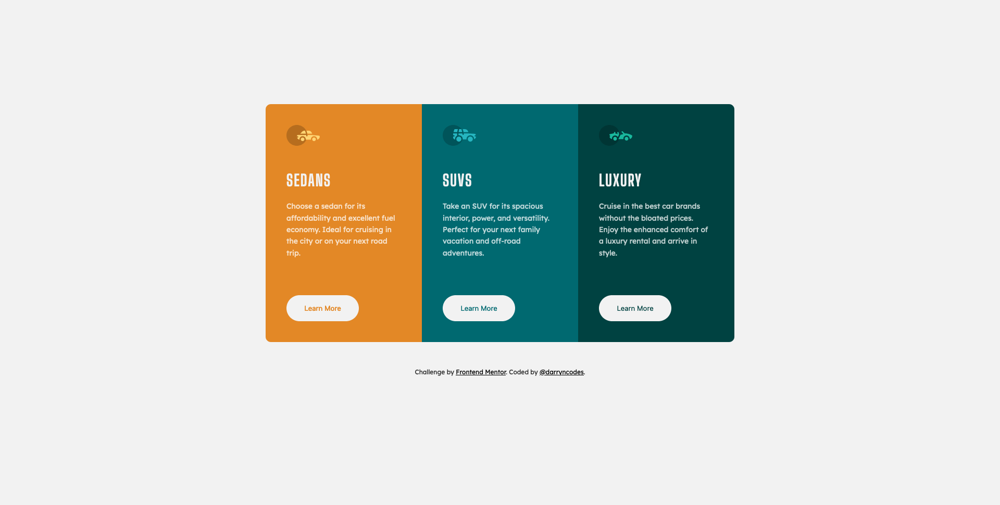

# Frontend Mentor - 3-column preview card component solution

This is a solution to the [3-column preview card component challenge on Frontend Mentor](https://www.frontendmentor.io/challenges/3column-preview-card-component-pH92eAR2-). Frontend Mentor challenges help you improve your coding skills by building realistic projects.

## Table of contents

-   [Overview](#overview)
    -   [The challenge](#the-challenge)
    -   [Screenshot](#screenshot)
    -   [Links](#links)
-   [My process](#my-process)
    -   [Built with](#built-with)
    -   [What I learned](#what-i-learned)
    -   [Continued development](#continued-development)
-   [Author](#author)

## Overview

### The challenge

Users should be able to:

-   View the optimal layout depending on their device's screen size
-   See hover states for interactive elements

### Screenshot

### Links

-   [GitHub repo](https://github.com/darryncodes/3-column-preview-card)
-   [Solution URL](https://darryncodes.github.io/3-column-preview-card/)
-   [Live Site URL](https://www.darryncodes.co.uk/pages/3-column-preview-card.html)

## My process

### Built with

-   Semantic HTML5 markup
-   SASS
-   Flexbox
-   CSS Grid
-   BEM methodology

### What I learned

-   Continued practice with use of inline SVGs
-   I challenged myself to estimate how long the build would take and tried my best to stick to it
-   I also have put a lot of emphasis on design thinking, not rushing into a solution, planning it out, staying calmn and not loosing my head when things do not seem to work

### Continued development

-   Continue to embed real-world best practices like responsive design, readable code, comments and use don't repeat yourself principles
-   Consider mobile first approach

## Author

-   Work in progress portfolio site - [@darryncodes](https://www.darryncodes.co.uk/)
-   Frontend Mentor - [@yourusername](https://www.frontendmentor.io/profile/darryncodes)
